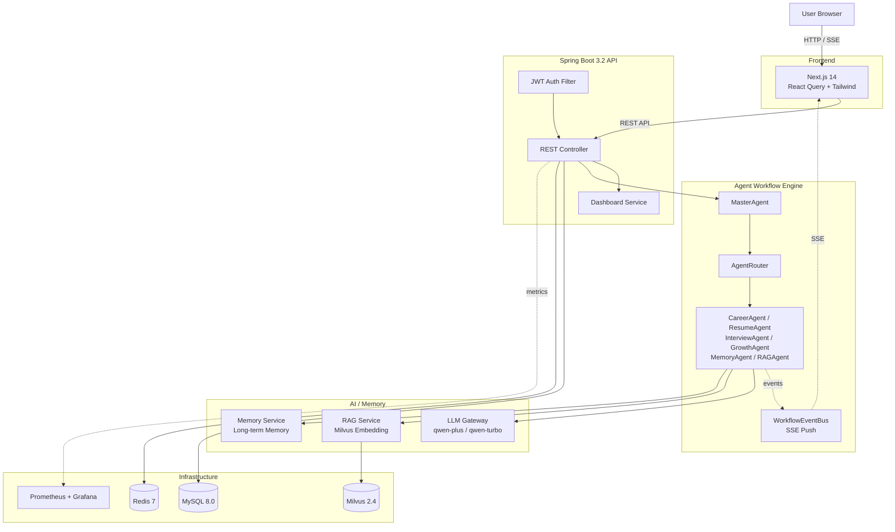

# FocusOS AI

> 基于 Spring Boot + LangChain4j 构建的个人 **AI Career Operating System** —— 把求职流程从手工操作升级为多 Agent 自动化工作流。

<p align="center">
  <em>RAG · Multi-Agent Workflow · Resume Intelligence · Interview Agent · Career Growth · Agent Evaluation</em>
</p>

---

## Features

### Personal RAG

用户私有知识库，支持 Markdown / PDF / TXT 文档向量化检索。

- 基于 **Milvus** 持久化向量存储，重启不丢数据
- **Embedding** 模型：`text-embedding-v2`（DashScope）
- **Metadata 隔离**：每条向量携带 `userId / documentId / fileName`，严格按用户隔离
- 文档工作流：`Document → Chunk → Embedding → Milvus`

### Multi-Agent Workflow

由 `MasterAgent` + `AgentRouter` 组成的 DAG 工作流引擎，6 个职业 Agent 协同执行。

| Agent | 职责 |
|-------|------|
| `CareerAgent` | JD 分析、岗位匹配度评分 |
| `ResumeOptimizationAgent` | STAR 原则简历优化 |
| `InterviewAgent` | 面试题生成 + 模拟面试评价 |
| `CareerGrowthAgent` | 技能缺口分析 + 学习路径规划 |
| `ResumeEvaluatorAgent` | 简历质量评分 |
| `MemoryAgent` | 用户长期记忆管理 |

工作流 DAG：

```
CAREER_ANALYSIS → RESUME_OPTIMIZATION ─┬→ SKILL_GAP_ANALYSIS → LEARNING_PLAN
                                       └→ INTERVIEW_PREPARATION → MOCK_INTERVIEW
```

### Resume Intelligence

- **JD 分析**：抽取岗位硬性要求 / 加分项 / 公司信息
- **STAR 简历优化**：按 Situation / Task / Action / Result 重写经历
- **版本管理**：`ResumeVersion` 持久化多版本，支持激活 / 回滚
- **Diff 对比**：`ResumeDiffService` 高亮原文与优化版的差异

### Interview Agent

- **模拟面试**：根据目标 JD 生成针对性问题，用户作答
- **自动评分**：对每条回答进行多维度评分（技术深度 / 表达清晰度 / STAR 完整性）
- **事实核查**：`GroundingChecker` 基于 RAG 知识库检测无据陈述

### Memory System

- **长期记忆**：`UserMemory` 实体，按 `MEMORY / PREFERENCE / FACT / SKILL / EXPERIENCE` 分类
- **Agent 上下文增强**：每次 Agent 调用前注入相关 Memory，提升回答个性化程度
- **合并策略**：`MemoryMergeStrategy` 自动去重 / 合并相似记忆

### Agent Evaluation

独立的 Agent 质量评估框架，不依赖人工标注。

- **RAG Evaluation**：`contextRecall` / `contextPrecision` / `faithfulness`
- **Grounding Detection**：检测 Agent 输出是否 anchored 在 RAG 检索结果
- **Faithfulness Check**：拆分声明级粒度核验
- LLM 不可用时降级为关键词匹配启发式评估

### Production Engineering

| 能力 | 实现 |
|------|------|
| Redis Task Queue | `WorkflowScheduler` 持久化 + 入队，`AgentWorker` 线程池消费 |
| Workflow Persistence | `WorkflowInstance` 实体 + 状态机（PENDING / RUNNING / PAUSED / SUCCESS / FAILED / RETRYING） |
| Retry | `RetryManager` 实现 2s / 5s / 10s 退避策略 + maxRetry 限制 |
| LLM Gateway | 统一调用入口 + 模型路由 + 超时控制 + Fallback 链 |
| Cache | 两级缓存：Redis + ConcurrentHashMap 降级 |
| Quota | `UserQuota` 每日 Token 配额（DEFAULT 10k / PREMIUM 100k） |
| Observability | Prometheus + Grafana（5 个核心业务指标） |
| Prompt Security | `PromptSecurityFilter` 检测 5 类 Prompt Injection 攻击 |
| Docker | `docker compose up` 一键启动 7 个服务 |

---

## Architecture



---

## Tech Stack

### Frontend

- **Next.js 14** (App Router)
- **TypeScript**
- **TailwindCSS** + Linear / Notion / Vercel 风格设计
- **React Query** (TanStack Query) 数据获取
- **Zustand** 状态管理
- **Recharts** 数据可视化

### Backend

- **Spring Boot 3.2.5**
- **Java 17**
- **LangChain4j 1.0.0-beta2**
- **Spring Data JPA** + Hibernate
- **Spring Security** + JWT
- **SpringDoc OpenAPI** Swagger 文档
- **Lombok**
- **Apache PDFBox 3.x** PDF 导出

### AI

- **RAG**：检索增强生成（Retrieve → Reorder → Generate）
- **Embedding**：`text-embedding-v2`（DashScope，1536 维）
- **Vector Database**：Milvus 2.4 Standalone
- **LLM**：Qwen-Plus（主） + Qwen-Turbo（备用 / 路由）

### Infrastructure

- **Redis 7** 任务队列 + 缓存
- **MySQL 8.0** 业务数据持久化
- **MinIO** Milvus 对象存储
- **etcd** Milvus 元数据存储
- **Nginx** 反向代理 + SSE 长连接支持
- **Prometheus + Grafana** 可观测性
- **Docker Compose** 一键部署（7 服务）
- **GitHub Actions** CI/CD

---

## Quick Start

### 前置要求

- Docker 24+ & Docker Compose v2
- 至少一个 LLM API Key（默认使用阿里云 DashScope，兼容 OpenAI 协议）

### 方式一：Docker Compose 一键启动（推荐）

```bash
# 1. Clone 仓库
git clone https://github.com/your-username/focusos-ai.git
cd focusos-ai

# 2. 复制环境变量模板并填入真实值
cp .env.example .env
#   编辑 .env，至少配置：
#     LLM_API_KEY=sk-xxxxx          (必填)
#     JWT_SECRET=<openssl rand -base64 64>
#     MYSQL_PASSWORD=<your-password>
#     MYSQL_ROOT_PASSWORD=<your-password>

# 3. 启动全部服务（MySQL + Redis + Milvus + Backend + Nginx + Prometheus + Grafana）
docker compose up -d

# 4. 查看启动状态
docker compose ps
```

启动完成后：

| 服务 | 地址 | 默认账号 |
|------|------|----------|
| Frontend (via Nginx) | http://localhost | - |
| Backend API | http://localhost:8080/api | - |
| Swagger UI | http://localhost:8080/api/swagger-ui.html | - |
| Grafana | http://localhost:3001 | admin / admin |
| Prometheus | http://localhost:9090 | - |
| MinIO Console | http://localhost:9001 | minioadmin / minioadmin |

> **登录账号**：默认管理员 `admin / admin123`（在 `data.sql` 中初始化），首次登录后请立即修改密码。

### 方式二：本地开发模式

```bash
# 1. 启动基础设施（仅 MySQL + Redis + Milvus）
docker compose up -d mysql redis etcd minio milvus

# 2. 启动后端
cd backend
cp ../.env.example ../.env  # 填入 LLM_API_KEY 等
./mvnw spring-boot:run

# 3. 启动前端
cd ../frontend
cp .env.local.example .env.local  # 设置 NEXT_PUBLIC_API_URL=http://localhost:8080
npm install
npm run dev
```

### 环境变量

完整环境变量清单见 [.env.example](./.env.example)，关键变量：

| 变量 | 必填 | 说明 |
|------|------|------|
| `LLM_API_KEY` | ✅ | LLM 服务 API Key |
| `JWT_SECRET` | ✅ | JWT 签名密钥（≥256 bits） |
| `MYSQL_PASSWORD` | ✅ | MySQL 业务用户密码 |
| `MYSQL_ROOT_PASSWORD` | ✅ | MySQL root 密码 |
| `MILVUS_ENABLED` | - | `false` 时降级到 InMemoryEmbeddingStore（仅本地测试） |

---

## Demo

完整的 Career Workflow 演示流程：

```
1. 登录 → Dashboard 首页
   ↓
2. 查看当前 AI 职业状态（5 张聚合卡片）
   ↓
3. 输入 JD → 启动 Career Workflow
   ↓
4. 实时查看 Agent 执行过程（SSE + DAG 可视化）
   ↓
5. 查看分析报告（matchScore / advantages / gaps）
   ↓
6. 管理简历（多版本 + Diff 对比 + PDF 导出）
   ↓
7. 模拟面试（问题生成 + 作答 + 评分 + 事实核查）
   ↓
8. 查看成长路线（学习计划 + 周进度）
   ↓
9. 访问 /workflow/[id] 查看工作流详情（Task 列表 + LLM 成本）
```

> Demo 视频与截图见 `docs/screenshots/`（待补充）。

---

## Screenshots

截图存放目录：[`docs/screenshots/`](./docs/screenshots/)

| 模块 | 截图 | 说明 |
|------|------|------|
| Dashboard 首页 | `dashboard.png` | 5 张职业状态卡片 + Career Timeline |
| Career Workflow | `career-workflow.png` | JD 输入 + Agent 执行 DAG |
| Resume Workspace | `resume-workspace.png` | 简历编辑器 + Diff 对比 |
| Interview Agent | `interview.png` | 模拟面试问答 + 评分 |
| Workflow Detail | `workflow-detail.png` | Task 列表 + LLM 调用汇总 |
| Grafana Monitoring | `grafana.png` | 业务指标仪表盘 |

---

## Project Structure

```
FocusOS-AI
├── backend/                    Spring Boot 3.2 后端
│   ├── src/main/java/com/focusos/
│   │   ├── agent/              Agent 实现（CareerAgent / ResumeAgent / ...）
│   │   ├── config/             配置类（Security / Redis / Milvus / LLM）
│   │   ├── controller/         REST Controller
│   │   ├── dto/                请求 / 响应 DTO
│   │   ├── entity/             JPA 实体
│   │   ├── repository/         Spring Data JPA Repository
│   │   ├── service/            业务 Service
│   │   └── store/              Milvus 自定义 EmbeddingStore
│   ├── src/main/resources/
│   │   ├── application*.yml    Spring 配置（dev / prod）
│   │   ├── prompts/            Agent Prompt 模板（YAML）
│   │   ├── schema.sql          数据库 DDL
│   │   └── data.sql            初始化数据
│   ├── Dockerfile
│   └── pom.xml
├── frontend/                   Next.js 14 前端
│   ├── src/
│   │   ├── app/                App Router 页面
│   │   ├── components/         UI 组件
│   │   ├── hooks/              React Query hooks
│   │   ├── lib/                API client / utils
│   │   └── store/              Zustand store
│   ├── Dockerfile
│   └── package.json
├── monitor/                    Prometheus + Grafana 配置
├── nginx/                      Nginx 反向代理配置
├── scripts/                    QA 测试脚本（Python）
├── .github/workflows/          GitHub Actions CI/CD
├── docs/                       技术文档
├── docker-compose.yml          一键部署编排
├── .env.example                环境变量模板
├── LICENSE                     MIT License
└── README.md
```

---

## Documentation

- [Architecture](./docs/architecture.md) — 系统架构、Agent Workflow、RAG 流程、Memory 机制
- [API Reference](./docs/api.md) — 主要 REST API 列表

---

## Roadmap

### Completed

- ✅ Multi-Agent Workflow（MasterAgent + DAG 路由 + SSE 实时推送）
- ✅ Personal RAG（Milvus 持久化 + 用户隔离 + 向量重建）
- ✅ Long-term Memory（分类存储 + 合并策略 + Agent 上下文增强）
- ✅ Career Assistant（JD 分析 + 岗位匹配 + STAR 简历优化）
- ✅ Resume Workspace（多版本 + Diff + PDF 导出）
- ✅ Interview Agent（模拟面试 + 评分 + 事实核查）
- ✅ Career Growth Planning（技能缺口 + 学习路径 + 周计划）
- ✅ Agent Evaluation（RAG Evaluation + Grounding + Faithfulness）
- ✅ LLM Observability（LLM Gateway + Token 配额 + 成本追踪）
- ✅ Production Engineering（Docker + CI/CD + Prometheus + Grafana）
- ✅ Product Experience（Dashboard + Career Timeline + Agent 可视化）

---

## License

[MIT License](./LICENSE) © 2026 FocusOS AI
